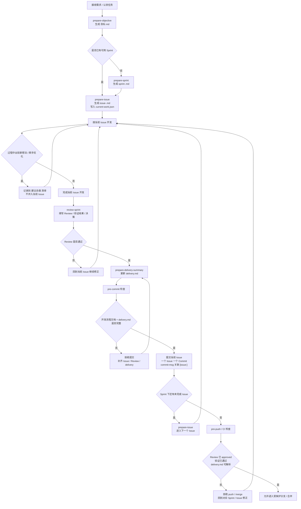

# Agent 扩展团队开发规范

> 目标：保证 Agent 扩展开发在多轮协作中持续收敛，避免需求漂移、范围膨胀和实现偏航。

## 1. 适用范围

本规范适用于所有 Agent 扩展相关的设计、开发、评审、验收与上线流程。

说明：

- 本文档是正式规范，约束团队执行方式。
- 实践心得与背景说明见 `docs/agent-development-note.md`。

## 2. 术语定义

- **Sprint**：面向一个阶段目标的开发单元，负责定义方向和边界。
- **Issue**：Sprint 下的最小交付单元，必须可独立开发、验收和回归。
- **Review**：每完成一个 Issue 后，对照 Sprint 目标检查是否偏离的过程。

## 3. 基本原则

1. **先 Sprint，后 Issue**：任何大任务先定义阶段目标，再拆分为 Issue。
2. **Issue 只做一件事**：每个 Issue 只能解决一个明确问题，不能顺手扩展其他需求。
3. **超范围必须回到 Sprint**：凡是新增需求、目标变化或范围扩大，必须先回到 Sprint 重新确认。
4. **每个 Issue 必须 Review**：完成一个 Issue 后，必须先做偏离检查，再进入下一个 Issue。
5. **Sprint 结束统一验收**：所有 Issue 完成后，按 Sprint 目标做整体验收。

## 4. 标准流程

### 4.1 流程总览



### 4.2 Sprint 定义

每个 Sprint 必须明确以下内容：

- 目标
- 范围
- 非目标
- 验收标准
- Owner
- 风险与依赖

### 4.3 Issue 拆分

每个 Issue 必须满足以下要求：

- 目标单一
- 交付物明确
- 影响范围明确
- 验收标准明确
- 测试方式明确
- 非目标明确

### 4.4 开发执行

- 仅在当前 Issue 范围内实现。
- 如发现新需求或目标变化，必须暂停当前实现，先更新 Sprint。
- 不允许在 Issue 中“顺手优化”未计划内容；此类内容应记录到“建议去做”清单中。
- 非必要优化不在当前 Issue 内处理，等当前任务完成并 Review 通过后，再开启新的迭代计划继续做。

#### 4.4.1 前端高不确定性 Issue 执行规则

前端任务如果同时存在以下任一特征，视为“高不确定性 Issue”：

- 首次接入新的前端库或 runtime
- 同时跨 UI、状态管理、接口协议三个以上边界
- 交互路径较长，必须依赖真实异步链路验证
- 方案本身仍在探索，尚未冻结最小 happy path

这类 Issue 必须遵守以下额外规则：

- 先只完成最小主链路，不在同一个 Issue 内同时处理工程补强。
- 当前 Issue 只允许交付最小可验收结果，例如“能进入页面、能发消息、能看到结果、能恢复数据”。
- 任何不影响当前主链路成立的补强项，一律不在当前 Issue 内展开。
- 当前 Issue 完成后，必须先做 Review，再决定是否为补强项单开新 Issue。

这里的“工程补强”包括但不限于：

- 空数据清理、异常回滚、重试机制、取消机制
- 预加载、缓存优化、请求合并、并发保护
- 交互微调、加载态细化、提示文案打磨
- 容错兼容、埋点、监控、重构、代码整理

规则要求：

- 工程补强默认不进入当前高不确定性 Issue。
- 如补强项不是当前 Issue 的验收前置条件，必须记录到“建议去做”清单。
- 只有当补强项直接影响当前 Issue 是否成立时，才允许作为当前 Issue 的一部分处理，并且需要在 Review 中明确说明原因。

#### 4.4.2 单一事实收敛规则

一旦 `contract` 或 `architecture` 已冻结，开发过程中必须保证只有一个事实版本存在，禁止通过兼容层容忍“双轨事实共存”。

这里的“双轨事实共存”包括但不限于：

- service 层同时兼容两种冲突的响应结构
- types 层表达的语义与 contract 不一致
- API 实际返回与冻结文档语义不一致
- Review 已发现漂移，但后续开发继续建立在漂移后的事实之上

必须执行以下规则：

- 冻结文档存在时，默认以文档为唯一事实源，不以“当前实现能跑”替代文档约束。
- 发现文档与实现漂移时，第一动作必须是停止继续开发，先判断应该改文档还是改实现。
- 未显式定义兼容期、迁移步骤、清理时间点时，不允许双写、双读、双消费两套冲突语义。
- `service` 和 `types` 的职责是把事实收敛到冻结 contract，不允许以“兼容旧版/新版”为由继续传播漂移。
- 文档不满足要求、文档不完整或文档本身有误时，必须先和用户对齐；在对齐完成前，不得直接进入开发。

### 4.5 AI 协作执行要求

使用 AI 进行代码开发时，必须遵守以下要求：

- AI 开始实现前，必须先复述当前 Sprint 目标、当前 Issue 目标、非目标、计划改动范围、验证方式。
- 单次 AI 会话默认只处理一个 Issue，不跨多个未完成的 Issue 并行扩展。
- 如 AI 在执行过程中提出额外优化建议，应记录到“建议去做”清单，不直接并入当前任务。
- 对于前端高不确定性 Issue，AI 必须先声明“本次只做最小主链路，不做工程补强”；补强项统一转入“建议去做”清单。
- AI 输出的“已完成”必须附带验证结果，不能只给结论。
- 未完成 Review 前，不得直接让 AI 继续下一个 Issue。

#### 4.5.1 AI 会话切分规则

默认规则：

- 一个 Issue 对应一个主对话。
- 一个新的 bug 默认开启新的 AI 对话，不直接复用历史长对话。

只有在同时满足以下条件时，才允许在当前对话继续修复：

- 该 bug 是当前 Issue 的直接 Review finding，而不是新需求或新缺陷单。
- 当前 Issue 仍处于同一轮修复阶段，尚未结束 Review，也尚未切到下一个 Issue。
- 本次修复仍然可以保持“单问题、最小改动、最小验证”。
- 当前对话不会因此同时并行处理多个 finding。

出现以下任一情况时，必须开启新对话：

- bug 已经脱离当前 Issue，属于新的缺陷或新的返工任务。
- 当前 Issue 已完成 Review 或已进入提交后的下一阶段。
- 修复该 bug 需要重新定义目标、非目标、范围或验收标准。
- 发现 `contract` / `architecture` / 实现之间存在漂移，需要重新先做对齐。
- 当前对话已经明显过长，AI 推理速度下降、上下文继承风险变高。

执行要求：

- Review finding 若仍属于当前 Issue，必须按优先级逐条修复，一次只处理一个 finding。
- 新 bug 若不属于当前 Issue，必须先建新 Issue（或明确挂靠已有 Issue），再开新对话。
- 不允许在“修当前 finding”的过程中顺手吸收其他新 bug。

#### 4.5.2 新 bug 对话模板

新的 bug 默认使用下面模板发起，不允许只丢一段报错或一句“帮我修一下”：

```text
这是一个新的 bug 修复任务，不继承上一个任务的隐含结论。

bug:
- <现象 / 报错 / review finding>

以这些文档或契约为准：
- <contract / architecture / spec / issue 文档路径>

预期行为：
- <应该发生什么>

非目标：
- <这次明确不做什么>

改动范围：
- <允许修改的模块 / 文件范围>

验证：
- <最小测试 / 手工验收 / 命令>

要求：
- 单问题
- 最小改动
- 最小验证
- 修完后说明根因
```

规则要求：

- 新对话的第一句话必须明确声明“这是一个新的 bug 修复任务”。
- 必须显式写清楚“以什么文档或契约为准”。
- 必须显式写清楚非目标，防止 AI 顺手扩展。
- 必须显式写清楚验证方式，避免只返回“已修复”结论。

#### 4.5.3 Review 后 bug 处理流程

Review 之后的处理流程固定如下：

1. 当前 Issue 完成实现后，先进入 Review。
2. Review 如果发现 finding，先判断该 finding 是否仍属于当前 Issue。
3. 若属于当前 Issue：
   - 留在当前对话继续修复；
   - 一次只修一个 finding；
   - 修完后重新给出验证结果。
4. 若不属于当前 Issue：
   - 不在当前对话继续展开；
   - 记录为新 bug / 新 Issue；
   - 用“新 bug 对话模板”开启新对话处理。
5. 只有当前 Issue Review 通过后，才允许提交并进入下一个 Issue。

### 4.6 Issue Review

每个 Issue 完成后，必须检查：

- 是否仍然服务于 Sprint 目标
- 是否产生额外复杂度
- 是否扩大了原始范围
- 下一步 Issue 是否仍然成立
- `contract / architecture / service / types / API` 是否仍然保持单一事实一致

Review 输出至少应包含：

- 本次交付内容
- 验证结果
- 偏离检查结果
- 是否产生新的“建议去做”项
- 是否允许进入下一个 Issue

#### 4.6.1 Review Checklist

每次 Review 必须显式完成以下检查，不允许省略：

1. **Contract 检查**
   - 当前实现是否仍符合冻结 `contract`
   - 是否新增、删除或改变了已有字段语义

2. **Architecture 检查**
   - 当前实现是否仍符合 `architecture` 规定的边界
   - 是否出现跨层穿透、职责错位或额外耦合

3. **Service 检查**
   - `service` 是否仍只表达单一响应语义
   - 是否存在“数组和 `{ results }` 并存”这类兼容式兜底

4. **Types 检查**
   - `types` 是否准确表达冻结 contract
   - 是否出现为了迎合当前实现而偷偷收窄、放宽或改名

5. **API 检查**
   - API 实际返回是否与 contract 示例和语义一致
   - 是否存在接口行为已变化但文档未同步的情况

6. **单一事实结论**
   - `contract / architecture / service / types / API` 五处是否仍是同一个事实来源
   - 如发现任一漂移，Review 必须直接判定为“未通过”，先收敛，再进入下一个 Issue

### 4.7 Issue 提交要求

- 每完成一个 Issue，必须单独提交一次 Commit。
- 一个 Issue 应尽量对应一个 Commit，作为最小交付和回溯单位。
- 不允许把多个无关 Issue 混在同一个 Commit 中提交。
- 当前 Issue 未完成 Review 前，不得提前提交并进入下一个 Issue。
- Commit 信息必须显式关联当前 Issue，保证代码、文档、Review 记录可追溯。
- Issue 关联标识应单独占一行，避免与摘要混在一起，便于阅读和自动校验。

推荐格式：

```text
<type>(<scope>): <summary>

[issue:<issue-id>]
```

示例：

```text
feat(agent): add run report route

[issue:I1]

fix(e2e): correct issue review status sync

[issue:I2]

refactor(agent): simplify sprint context loader

[issue:I3]
```

如一个 Issue 在开发中包含少量补充修正，应在进入主分支前整理为同一 Issue 的单一提交结果，避免一个 Issue 在历史中拆成过多零散 Commit。

### 4.8 Sprint 验收

Sprint 结束时，必须做一次整体验收，确认所有 Issue 串联后的结果仍符合最初目标。

## 5. 提高约束力的执行机制

仅靠口头约定不足以保证执行，必须把规范落到流程和工具上。

### 5.1 模板强制化

- Sprint、Issue、PR 必须使用统一模板。
- 模板字段不完整时，不能进入开发或合并。

### 5.2 评审门禁

- 未完成 Review 的 Issue 不能进入下一步。
- 未通过 Code Review 的 PR 不能合并。
- 发现范围偏离时，必须退回 Sprint 层重新确认。

### 5.3 责任明确化

- 每个 Sprint 必须有明确 Owner。
- 每个 Issue 必须有明确负责人和 Reviewer。
- 变更必须可追溯到具体 Issue 或 Sprint。

### 5.4 证据化验收

- 所有交付必须附带测试结果、截图、日志或演示说明。
- 没有证据的“已完成”不视为完成。

### 5.5 变更显式化

- 任何超出原范围的需求都必须显式记录为变更。
- 变更未被确认前，不得在当前 Issue 中直接吸收。
- 对于暂时不做的优化项，应统一进入“建议去做”清单，作为后续迭代输入，而不是当场展开实现。

### 5.6 建议去做清单

- 所有非必要、非阻塞、但值得优化的内容，统一进入“建议去做”清单。
- 清单只记录，不默认执行。
- 当前任务完成后，先 Review，确认无偏离，再基于清单开启新的迭代计划。
- 只有新迭代计划被确认后，才可以把清单中的内容拆成新的 Sprint / Issue。
- 前端高不确定性 Issue 里产生的工程补强项，必须优先进入该清单，不能在当前 Issue 中直接吸收。

### 5.7 完成定义

一个 Issue 只有同时满足以下条件，才视为完成：

- 交付物已实现
- 验收标准已对照完成
- 测试或验证证据已附带
- Review 已通过
- 新增优化项已转入“建议去做”清单
- 已形成独立 Commit，且 Commit 信息已关联 Issue

未满足以上任一条件，不得标记为完成，不得进入下一个 Issue。

## 6. 违规处理

- 发现偏离：立即回退到当前 Issue 或 Sprint 重新确认。
- 发现遗漏：补齐模板、补充测试、补充 Review。
- 重复违规：由 Sprint Owner 进行明确提醒和纠偏。

## 7. 核心结论

**Sprint 负责方向，Issue 负责执行，Review 负责纠偏。**

要提高约束力，关键不是“提醒大家遵守”，而是把规范变成模板、门禁、责任和证据，让不遵守规范无法顺利进入下一步。
