# Plane CE 架构文档

> 本文档描述 Plane CE 的系统架构、技术栈、业务数据模型及核心流程。

---

## 目录

- [一、技术栈总览](#一技术栈总览)
- [二、系统架构](#二系统架构)
  - [2.1 服务依赖关系](#21-服务依赖关系)
  - [2.2 生产环境网络拓扑](#22-生产环境网络拓扑)
  - [2.3 本地开发 vs 生产环境端口对照](#23-本地开发-vs-生产环境端口对照)
- [三、业务数据模型](#三业务数据模型)
  - [3.1 整体层级关系](#31-整体层级关系)
  - [3.2 实体关系图（ER）](#32-实体关系图er)
  - [3.3 业务流程关系图](#33-业务流程关系图)
  - [3.4 Issue 与 Cycle / Module 归属规则](#34-issue-与-cycle--module-归属规则)
  - [3.5 Workspace（工作区）](#35-workspace工作区)
  - [3.6 Project（项目）](#36-project项目)
  - [3.7 Issue（工作项）](#37-issue工作项)
  - [3.8 Cycle（周期）](#38-cycle周期)
  - [3.9 Module（模块）](#39-module模块)
  - [3.10 Page（页面）](#310-page页面)
  - [3.11 推荐工作流](#311-推荐工作流)
- [四、核心业务流程](#四核心业务流程)
  - [4.1 用户登录流程](#41-用户登录流程)
  - [4.2 创建工作项流程](#42-创建工作项流程)
  - [4.3 文件上传流程](#43-文件上传流程)
  - [4.4 异步任务流程](#44-异步任务流程)
  - [4.5 实例初始化流程](#45-实例初始化流程)

---

## 一、技术栈总览

| 组件               | 技术                    | 职责                                      |
| :----------------- | :---------------------- | :---------------------------------------- |
| **web**            | Next.js + React         | 主应用界面（工作项、看板、周期等）        |
| **admin**          | Vite + React            | 实例管理后台（God Mode）                  |
| **space**          | Next.js + React         | 公开项目空间（免登录访问）                |
| **live**           | Node.js + WebSocket     | 实时协作服务（Page 多人编辑）             |
| **api**            | Django + DRF + Gunicorn | REST API，核心业务逻辑                    |
| **worker**         | Celery                  | 异步任务（邮件、导出、AI 等）             |
| **beat-worker**    | Celery Beat             | 定时任务调度                              |
| **migrator**       | Django manage.py        | 数据库结构迁移（启动时一次性运行）        |
| **proxy**          | Caddy / Nginx           | 反向代理，统一入口（仅生产）              |
| **PostgreSQL**     | postgres:15.7           | 主数据库                                  |
| **Redis / Valkey** | valkey:7.2              | 缓存 + Session + 分布式锁                 |
| **RabbitMQ**       | rabbitmq:3.13           | Celery 消息队列                           |
| **MinIO**          | minio/minio             | S3 兼容对象存储（附件 / 图片 / 导出文件） |

---

## 二、系统架构

### 2.1 服务依赖关系

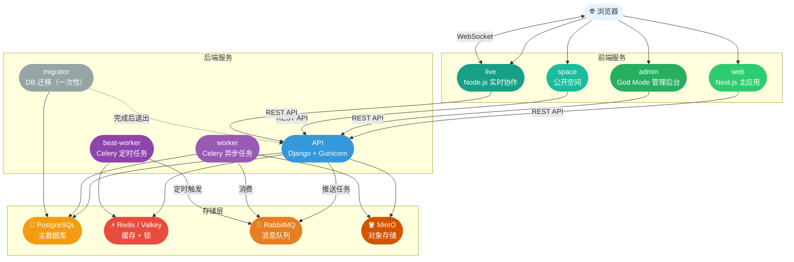

---

### 2.2 生产环境网络拓扑

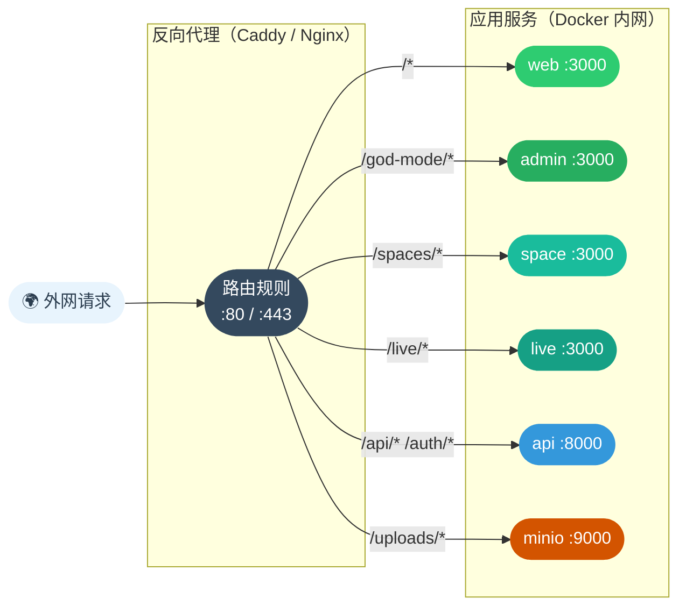

---

### 2.3 本地开发 vs 生产环境端口对照

| 服务              | 本地开发端口 | 生产环境访问方式            |
| :---------------- | :----------: | :-------------------------- |
| web（主应用）     |   `:3000`    | 反向代理 `/*`               |
| admin（God Mode） |   `:3001`    | 反向代理 `/god-mode/*`      |
| space（公开空间） |   `:3002`    | 反向代理 `/spaces/*`        |
| live（实时协作）  |   `:3100`    | 反向代理 `/live/*`          |
| API               |   `:8080`    | 反向代理 `/api/*` `/auth/*` |
| MinIO S3          |   `:9000`    | 反向代理 `/uploads/*`       |
| MinIO 控制台      |   `:9090`    | 不对外暴露                  |
| PostgreSQL        |   `:5432`    | 不对外暴露                  |
| Redis             |   `:6379`    | 不对外暴露                  |

---

## 三、业务数据模型

### 3.1 整体层级关系

```
Instance（实例）
└── Workspace（工作区）
    ├── WorkspaceMember（成员）
    ├── Team（团队）
    └── Project（项目）× 多个
        ├── ProjectMember（项目成员）
        ├── State（工作项状态定义）
        ├── Label（标签）
        ├── Estimate（工时估算方案）
        ├── Issue（工作项）× 多个
        │   ├── Sub-Issue（子任务，自引用）
        │   ├── IssueComment（评论）
        │   ├── IssueActivity（操作日志）
        │   └── IssueAttachment（附件）
        ├── Cycle（周期 / Sprint）× 多个
        │   └── CycleIssue（周期与工作项关联表）
        ├── Module（功能模块）× 多个
        │   └── ModuleIssue（模块与工作项关联表）
        └── Page（协作文档，Workspace 级，可关联多个 Project）
            └── PageVersion（历史版本）
```

---

### 3.2 实体关系图（ER）

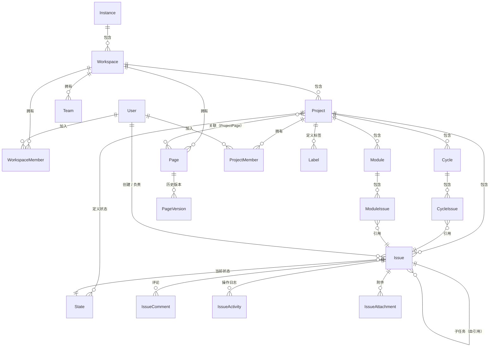

---

### 3.3 业务流程关系图

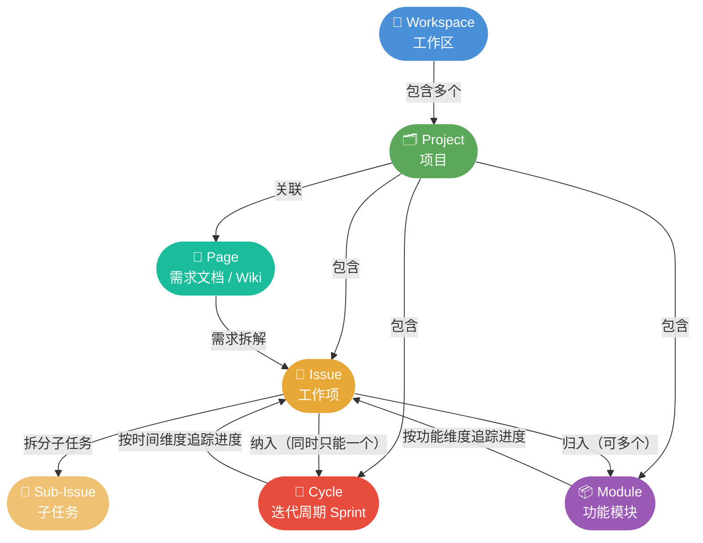

---

### 3.4 Issue 与 Cycle / Module 归属规则

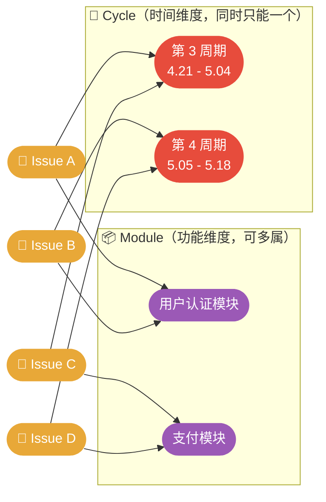

> **规则说明：**
>
> - ✅ 一个 Issue 可同时归属**多个 Module**（跨功能模块）
> - ⚠️ 一个 Issue **同时只能在一个 Cycle** 中（不允许跨期重叠）
> - 🔁 Issue 从 Cycle / Module 移除后，仍存在于 Project 中

---

### 3.5 Workspace（工作区）

> 整个系统的顶层容器，对应一个公司或团队组织。

**核心属性：**

| 属性                | 类型           | 说明                                   |
| :------------------ | :------------- | :------------------------------------- |
| `name`              | 字符串         | 工作区名称（最长 80 字符）             |
| `slug`              | slug           | URL 标识符，全局唯一（如 `/lixiang/`） |
| `owner`             | FK → User      | 创建者，拥有最高权限                   |
| `logo_asset`        | FK → FileAsset | Logo 图片（存储于 MinIO）              |
| `organization_size` | 字符串         | 组织规模                               |
| `timezone`          | 字符串         | 时区，新建 Project 默认继承此值        |
| `background_color`  | 字符串         | 背景颜色（随机生成）                   |

**成员角色（WorkspaceMember）：**

| 角色   | 权重值 | 权限说明                     |
| :----- | :----: | :--------------------------- |
| Admin  |   20   | 可管理工作区设置、成员、计费 |
| Member |   15   | 可创建和管理项目、工作项     |
| Guest  |   5    | 只读，受项目级开关控制       |

**关联关系：**

- 一个 Workspace 包含多个 **Project**
- **Page** 属于 Workspace 级，可跨项目关联
- **Team** 在 Workspace 级别管理，可跨项目协作

---

### 3.6 Project（项目）

> 工作的核心组织单元，对应一个产品线、服务或业务模块。

**核心属性：**

| 属性               | 说明                                                                     |
| :----------------- | :----------------------------------------------------------------------- |
| `name`             | 项目名称（Workspace 内唯一）                                             |
| `identifier`       | 缩写前缀，最长 12 字符，自动大写（如 `PROJ`），用于 Issue 编号 `PROJ-42` |
| `network`          | `0 = Secret`（私有）/ `2 = Public`（公开）                               |
| `project_lead`     | 项目负责人                                                               |
| `default_assignee` | 新建 Issue 的默认指派人                                                  |
| `default_state`    | 新建 Issue 的默认状态                                                    |
| `estimate`         | 关联的工时估算方案                                                       |
| `timezone`         | 项目时区（新建时继承 Workspace，可覆盖）                                 |
| `archive_in`       | 多少个月后自动归档 Issue（`0` = 不自动，最大 12）                        |
| `close_in`         | 多少个月后自动关闭 Issue（`0` = 不自动，最大 12）                        |

**功能开关（可按项目独立启用）：**

| 开关字段                   | 默认值 | 说明                     |
| :------------------------- | :----: | :----------------------- |
| `cycle_view`               | ❌ 关  | 是否启用周期（Sprint）   |
| `module_view`              | ❌ 关  | 是否启用模块             |
| `page_view`                | ✅ 开  | 是否启用页面文档         |
| `issue_views_view`         | ❌ 关  | 是否启用自定义视图       |
| `intake_view`              | ❌ 关  | 是否启用需求池（Intake） |
| `is_time_tracking_enabled` | ❌ 关  | 是否启用时间追踪         |
| `is_issue_type_enabled`    | ❌ 关  | 是否启用 Issue 类型区分  |
| `guest_view_all_features`  | ❌ 关  | Guest 是否可见所有功能   |

---

### 3.7 Issue（工作项）

> 系统最核心的工作单元，一条 Issue 代表一项具体的工作任务。

**核心属性：**

| 属性                              | 说明                                                  |
| :-------------------------------- | :---------------------------------------------------- |
| `name`                            | 标题                                                  |
| `description_html`                | 富文本描述                                            |
| `state`                           | 当前状态（关联项目自定义的 State 对象）               |
| `priority`                        | 优先级：`urgent` / `high` / `medium` / `low` / `none` |
| `assignees`                       | 负责人（支持多人，M2M）                               |
| `label`                           | 标签（支持多个，M2M）                                 |
| `start_date` / `due_date`         | 开始日期 / 截止日期                                   |
| `estimate_point`                  | 工时估算点数                                          |
| `sequence_id`                     | 项目内自增编号，与 `identifier` 拼成 `PROJ-42`        |
| `parent`                          | 父 Issue（自引用，支持多层子任务）                    |
| `external_source` / `external_id` | 外部系统导入来源（如 Jira、GitHub）                   |

**State 状态分组：**

```
backlog → unstarted → started → completed → cancelled
```

State 由项目自定义，分为以上五种内置分组，每组可创建多个自定义状态。

---

### 3.8 Cycle（周期）

> 固定时间盒，类似 Scrum Sprint，用于时间驱动的迭代管理。

**核心属性：**

| 属性                      | 说明                                                 |
| :------------------------ | :--------------------------------------------------- |
| `name`                    | 周期名称                                             |
| `start_date` / `end_date` | 严格的起止日期，决定周期状态                         |
| `owned_by`                | 周期负责人                                           |
| `timezone`                | 时区（跨区域团队保持日期一致）                       |
| `progress_snapshot`       | 定期进度快照，用于燃尽图                             |
| `status`                  | 由日期自动判断：`upcoming` / `current` / `completed` |

**典型使用节奏：**

```
创建 Cycle（每两周）
    │
    ├── 从各 Module 中挑选本期 Issue 放入
    │
    ├── 团队聚焦执行
    │
    └── 结束后 Review，未完成 Issue 转入下一个 Cycle
```

---

### 3.9 Module（模块）

> 按功能 / 特性组织工作的容器，时间线灵活，适合内容驱动的交付管理。

**核心属性：**

| 属性                         | 说明                                                                                   |
| :--------------------------- | :------------------------------------------------------------------------------------- |
| `name`                       | 模块名称                                                                               |
| `description`                | 富文本描述                                                                             |
| `start_date` / `target_date` | 计划时间线（灵活，不强制节奏）                                                         |
| `status`                     | 手动设置：`backlog` / `planned` / `in-progress` / `paused` / `completed` / `cancelled` |
| `lead`                       | 模块负责人                                                                             |
| `members`                    | 参与成员（M2M）                                                                        |

**Cycle vs Module 核心区别：**

| 维度       | 🔄 Cycle（周期）     | 📦 Module（模块）    |
| :--------- | :------------------- | :------------------- |
| 时间管理   | 固定时间盒，节奏驱动 | 灵活时间线，交付驱动 |
| 状态判断   | 由日期自动计算       | 手动维护状态         |
| 典型用途   | Sprint 冲刺迭代      | 功能模块交付         |
| Issue 归属 | 同时只能属于一个     | 可同时属于多个       |

---

### 3.10 Page（页面）

> 协作文档，用于记录需求、设计方案、会议纪要、技术规范等知识内容。

**核心属性：**

| 属性            | 说明                                                    |
| :-------------- | :------------------------------------------------------ |
| `name`          | 文档标题                                                |
| `description_*` | 富文本内容（JSON / HTML / 纯文本多格式存储）            |
| `owned_by`      | 创建者 / 所有者                                         |
| `access`        | `0 = Public`（工作区可见）/ `1 = Private`（仅自己可见） |
| `parent`        | 父页面（支持多层嵌套，构建知识树）                      |
| `is_locked`     | 锁定后只有所有者可编辑                                  |
| `is_global`     | 是否为全局页面（跨项目可见）                            |

**特殊说明：**

- 属于 **Workspace 级**，不绑定单个 Project，通过 `ProjectPage` 关联表可挂载到多个项目
- 由 **live 服务**（Node.js WebSocket）支持多人实时协作编辑
- 有完整的 **PageVersion** 版本历史，支持回滚
- `PageLog` 记录页面内对 Issue、Cycle、Module 的引用关系

---

### 3.11 推荐工作流

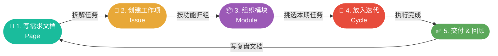

| 阶段 | 使用实体     | 核心操作                                      |
| :--: | :----------- | :-------------------------------------------- |
|  1   | Page         | 写清楚背景、目标、设计方案                    |
|  2   | Issue        | 从 Page 拆出可执行的最小任务（1~3天）         |
|  3   | Module       | 按功能边界将 Issue 归组（如「用户认证模块」） |
|  4   | Cycle        | 每两周从各 Module 挑 Issue 放入，聚焦执行     |
|  5   | Page + Cycle | 写复盘文档，未完成 Issue 转入下一个 Cycle     |

---

## 四、核心业务流程

### 4.1 用户登录流程

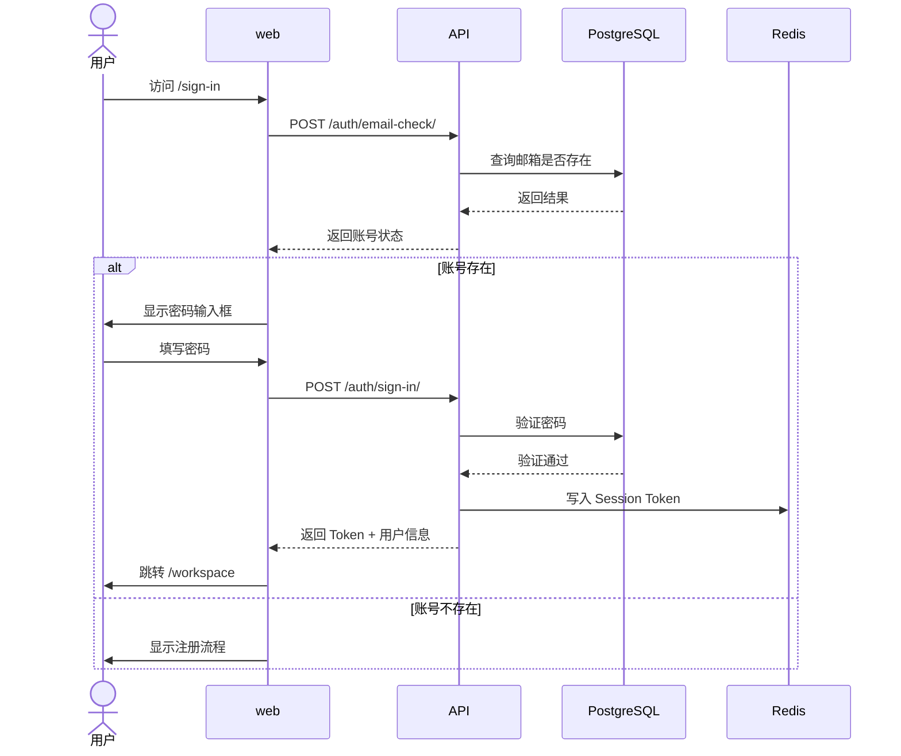

---

### 4.2 创建工作项流程

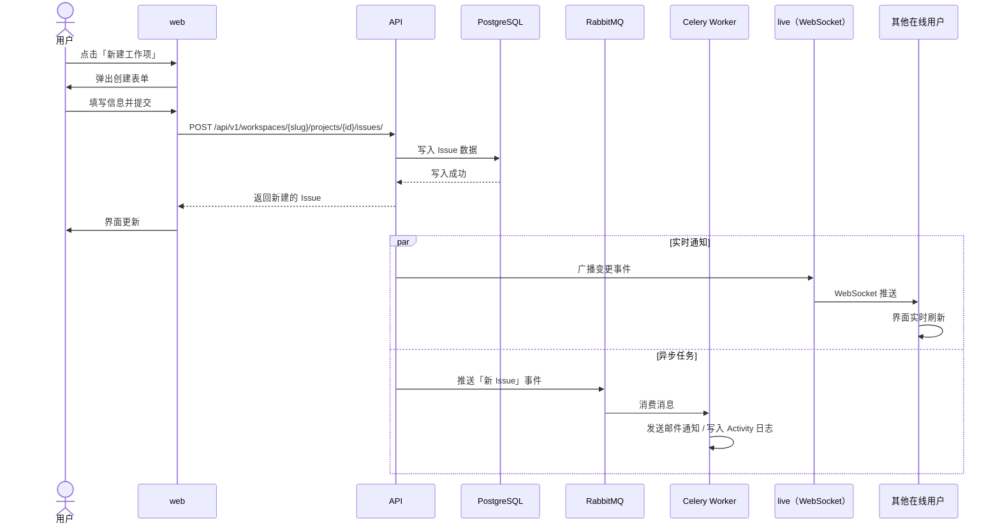

---

### 4.3 文件上传流程

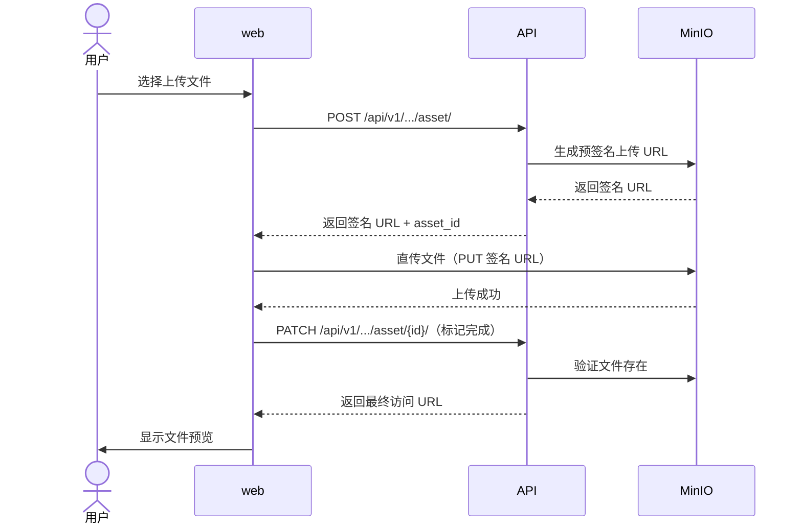

> **设计说明：** 浏览器直传 MinIO，API 仅负责签发 URL 和记录元数据，不承担文件传输带宽。

---

### 4.4 异步任务流程

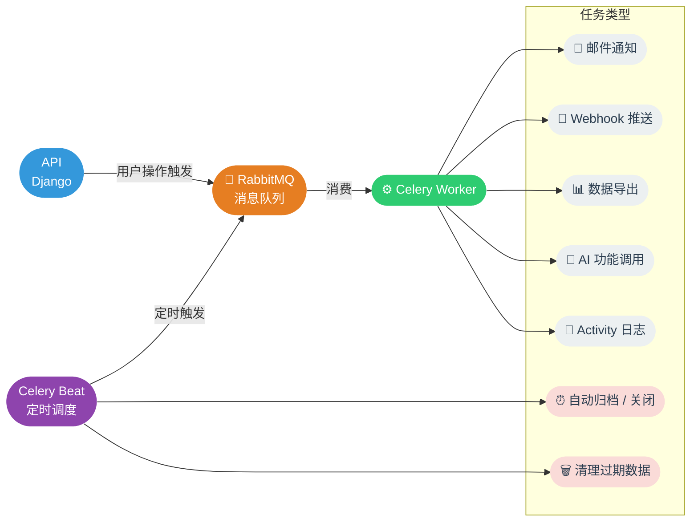

**定时任务执行周期：**

| 任务               | 周期           |
| :----------------- | :------------- |
| 批量发送邮件通知   | 每 5 分钟      |
| 实例状态上报       | 每 6 小时      |
| 自动归档超期 Issue | 每天 01:00 UTC |
| 清理孤立文件资产   | 每天 02:00 UTC |
| 清理过期导出链接   | 每天 01:30 UTC |
| 硬删除软删除数据   | 每天 00:00 UTC |

---

### 4.5 实例初始化流程

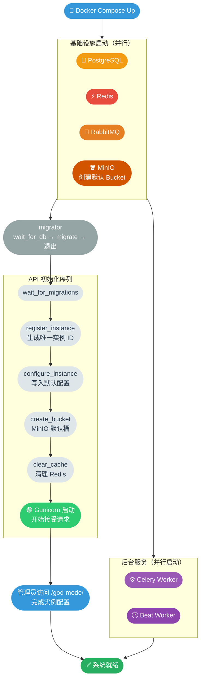
